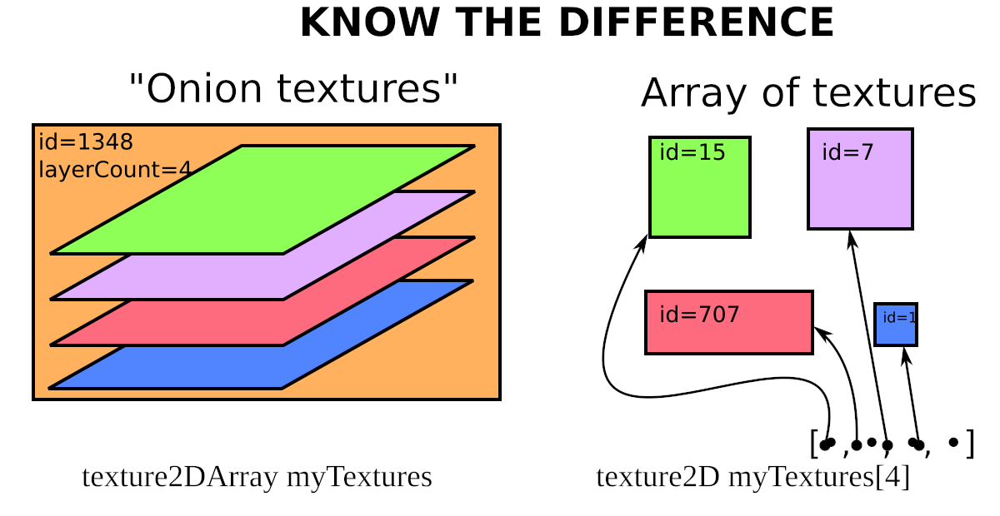
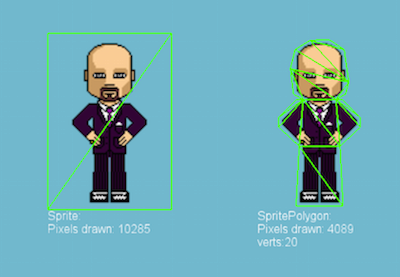
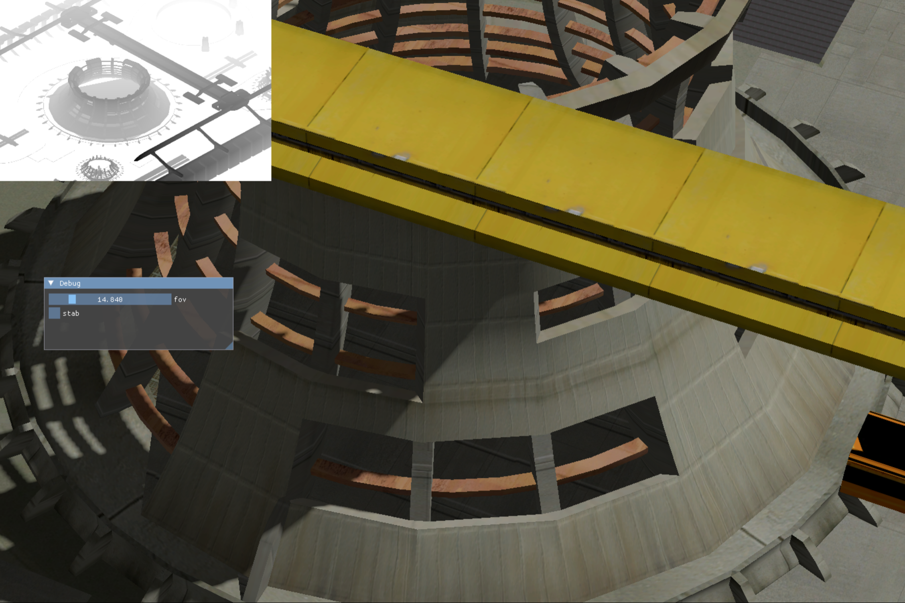
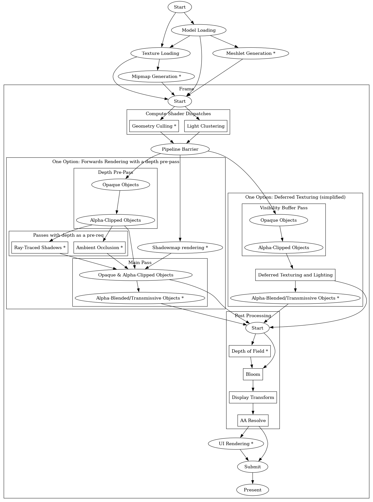

# GPU-driven rendering

The most important term you need to know is 'gpu-driven rendering'.

With a regular 'cpu-driven' pipeline the cpu has the authority on whats being rendered. It culls objects and issues commands like bind this texture, bind that texture, draw this, draw that etc. In this situation the GPU only recieves information about what the scene is like in bits and pieces, and can spend a significant amount of time switching between different textures and buffers, both of which add overhead. In technical terms, both the CPU and GPU are doing O(n) work with respect to the amount of geometry and textures.

In a gpu-driven pipeline, the GPU has all the scene information available to it simultaneously, and is able to manage it's own work via writing to an on-gpu buffer of draw calls to make. Objects can be culled beforehand via compute shaders without any information needing to be read back to the CPU. The CPU does O(1) work, basically just issuing a few compute shader dispatches and indirect draw calls, while the GPU can get on and render everything without overhead.

Here's a comparison between what a CPU-driven pipeline could look like (in pseudocode):

```python
for model in models {
    bind_appropriate_render_pipeline(cmdbuffer);
    bind_descriptor_set(model, cmdbuffer);
    bind_vertex_and_index_buffers(model, cmdbuffer);
    num_instances, instance_buffer = instance_buffer_for_model(model);
    bind_instance_buffer(instance_buffer, cmdbuffer);
    draw(num_instances, model.num_vertices);
}
```

and a GPU-driven pipeline:

```python
bind_all_buffers(cmdbuffer); # but implemented how?
bind_combined_model_descriptor_set(cmdbuffer); # but implemented how?

# Render pipelines are roughly merged together but still differentiated when it makes sense.
# Here we're dividing up geometry by blend mode, so all the opaque objects are drawn first,
# then all the alpha-clipped objects, etc.

bind_render_pipeline(cmdbuffer, opaque_pipeline);
draw_all_opaque_models(); # but implemented how?

bind_render_pipeline(cmdbuffer, alpha_clip_pipeline);
draw_all_alpha_clip_models();

bind_render_pipeline(cmdbuffer, alpha_blend_pipeline);
draw_all_alpha_blend_models();
```

There are 3 main requirements to unlocking GPU-driven rendering:
1. So-called 'bindless' texturing and buffers. I take this term to mean that you literally want to 'bind (textures/buffers) less' as opposed to never at all.
2. Merging pipelines together, by handing multiple materials or shading techniques with the same pipeline where possible. There are still reasons to differentiate pipelines, blending mode (opaque/alpha clipped/alpha blended) and animation state (static/skinned) being two examples. For a benchmark, [Doom Eternal used around 500 pipelines](https://vkguide.dev/docs/gpudriven/gpu_driven_engines/).
3. With the above two out of the way, you can yoink the pipeline, buffer and descriptor set bindings out of the `for` loop and you're just left with the draw calls, making them perfect targets for the second best API call in Vulkan, [`vkCmdDrawIndexedIndirect`](https://registry.khronos.org/vulkan/specs/1.3-extensions/man/html/vkCmdDrawIndexedIndirect.html), only followed by it's even better sibling, [`vkCmdDrawIndexedIndirectCount`](https://registry.khronos.org/VulkanSC/specs/1.0-extensions/man/html/vkCmdDrawIndexedIndirectCount.html). More on those later!

# Bindless

## Bindless geometry

There are roughly two ways to handle bindless geometry:

### Concatonate all geometry into big index + vertex buffers
- This works fine until you want to deallocate any geometry. If you store the ranges of where inside the buffer of where geometry is stored (e.g. `85337..190000`) then you can add that range to a list of empty gaps inside the buffer, and check that list when doing allocations. I've done this in the past.
- Handling defragmentation sounds painful though.

### Use a seperate buffer for each piece of geometry and use `VK_KHR_buffer_device_address` to access the buffers in shaders.
  - This is way nicer than the above IMO because it means you can rely on the allocator of your choice (e.g. VMA) to handle allocations and deallocations.
  - The main downside is that you are relying on `VK_KHR_buffer_device_address` (available on pretty much any devices) and that you have to manually access the index/vertex buffers in the vertex shader.

## Bindless textures

There's `VK_NVX_image_view_handle` which essentially does the same sorta thing as `VK_KHR_buffer_device_address` but it's Nvidia-only (for now) so we can ignore it.

### Megatextures

Yeah, no, these kinda suck unfortunately. They seem hard to manage and had a bunch of pop-in and other issues. RAGE had them, Doom 2016 had them (but less afaik?) and Doom Eternal got rid of them: https://www.doomworld.com/forum/topic/112067-so-megatextures-are-no-more-in-id-tech-7/

### Descriptor indexing / Arrays of textures

It's the better option! Still not great, but better.

The idea here is that you have a large array of image descriptors in a descriptor set that you index into dynamically in a shader. The terminology sucks here, as hopefully indicated by the below image. Handling new images is pretty easy, just add the image to the descriptor set and get it's index for accessing. For removals, you want to record that the index is empty and can be re-used. This works on most modern hardware. I think Macs had some problem with it a whileback (via MoltenVK) but that seems to no longer be an issue.


_from https://chunkstories.xyz/blog/a-note-on-descriptor-indexing/_

# Okay, but what about 2D games?

Does any of this stuff apply when you just want to render sprites and not 3D models? The short answer is yes. You should absolutely be treating any kind of 2D renderer the same was as a 3D one. The same considerations apply:

- Move as much work to the GPU as possible
- Do as much work in as few calls as possible
- Use the depth buffer as much as possible

For sprite-based games, this last part is especially important as almost every sprite makes use of an alpha channel. It's common practice for 2D games to enable alpha-blending in the pipeline and draw everything back-to-front, not using a depth buffer at all. This is really bad, as the amount of fragment shading work being done per-pixel scales with the number of sprites on screen.

Firstly, you want to create a tightly-bound mesh around the core of the sprite such that you are rendering very few areas that are completely transparent. This is a fairly well-known technique and you'll find a ton of mesh generators for this sort of thing, although I haven't used any myself. The extra triangle processing work is negligable compared to the savings on fragment work.



_Example from https://docs.cocos2d-x.org/cocos2d-x/v3/en/sprites/polygon.html_

What you want to do instead is to attempt to render everything front-to-back, writing a an appropriate value to the depth buffer for the 'layer' the sprite is on. For anything with more-or-less binary alpha, alpha-clipping via a `discard` in the fragment shader should get you what you want, although you might need some anti-aliasing such as [MSAA with alpha-to-coverage](https://bgolus.medium.com/anti-aliased-alpha-test-the-esoteric-alpha-to-coverage-8b177335ae4f). Any post-process anti-aliasing (see the section below) should also work.

Handling sprites with a significant amount of semi-transparent alpha is a bit harder.

Provided you don't mind matching a ground-truth alpha blend exactly, the first thing I'd try is using MSAA with [alpha-to-coverage](https://bgolus.medium.com/anti-aliased-alpha-test-the-esoteric-alpha-to-coverage-8b177335ae4f) along with [hashed alpha testing](https://cwyman.org/papers/i3d17_hashedAlpha.pdf). Depending on how that goes you could drop either the alpha-to-coverage requirement or the hashed-testing requirement.

If that's not good enough then you need another approach. I think you want to do things in two passes:
- Render the sprites front-to-back, either with a different mesh that contains only opaque pixels or by `discard`ing if the alpha value is less than 1, writing to the depth buffer
- Rendering all sprites again back-to-front with alpha-blending, such that only the fragment shader and blending are only performed for the semi-transparent regions.

This technique is fairly well documented and is mentioned in [this Arm Software Developers video](https://www.youtube.com/watch?v=q0uxKQe91Yk). Keep in mind that with this technique, you still have roughly O(n) overdraw for the number of sprites on the screen.

# Culling

- Compute shader takes in scene geometry and their bounding sphere and culls it if it's not visible in the view frustum.
- Could also cull against the previous frame's hierarchical depth buffer (see that Assassin's Creed: Unity slidedeck).
- Could also do LoD selection.
- Writes to a storage buffer with atomics.
- `vkCmdDrawIndexedIndirectCount` is called.

## Mesh shaders

Mesh shaders let you stream geometry from the scene description to the rasterizer, doing culling and LoD selection along the way. Afaik this is more flexible and faster as it doesn't involve a buffer write and readback.

# Forwards or deferred?

A: They both suck in their naïve implementations.

If you have

`P` = the number of pixels being rendered to
`L` = the number of lights in the scene
`G` = the number of geometry being written
`log2(G)` = roughly the amount of overdraw per pixel

then forwards is `O(P . L . log2(G))` and deferred is `O(P . log2(G) + P . L)`. Deferred is clearly better here. But it is super heavy in terms of the number of render targets it requires, especially for PBR where you have albedo+normal+metallic+roughness+(any other materials params, emission, IoR, clearcoat).

A few more modern options:

## Forwards with a depth pre-pass

- Still `O(P . log2(G) + P . L)`, but doesn't require any more render targets
- The depth pre-pass is super easy to intergrate, especially when doing bindless rendering
- Does have the downside of requiring the vertex shader and rasterizer be run twice for everything though

## Deferred texturing

- Instead of storing texture data in the deferred pass, store the data needed to read it!
- Could be a various combination of things but generally involves the triangle barycentrics (a `vec2`). Could be the Material ID + normal + barycentrics OR mesh id + triangle id + barycentrics or anything else
- `VK_KHR_fragment_shader_barycentric` makes implementation easier but I'm not sure how supported it is.
- See that 'deferred texturing in horizon forbidden west slidedeck'.

# Texture Formats

_TODO_

PNGs and JPEGs kinda suck for graphics, but you can get away with them if you've got a small sprite-based game. For anything else, either DDS (older and designed for DirectX) or KTX2 (newer and designed for Vulkan but less well supported) are good choices.

# Model Formats

_TODO_

Fbx or glTF?

# Shading

## Materials

For materials, PBR is the only thing that makes sense. I'm not quite sure where the best place to copy the BSDF functions from is, but there are many implementations available. Quite a few people mention https://google.github.io/filament/Filament.html.

## Lighting

- Standard Point Lights
- Linearly-Transformed-Cosine Line Lights
  - https://www.elopezr.com/rendering-line-lights/
  - https://zero-radiance.github.io/post/line-lights/
- Image-Based Lighting
  - IMO it's a little wasteful to use 2 seperate cubemaps for both the diffuse and specular BSDFs. Probably best to use spherical harmonics for the diffuse factor and the full cubemap for specular. See https://github.com/DGriffin91/cubemap-spherical-harmonics.

### Global Illumination

Global illumination is a big and complicated field, especially when we're talking about anything close to dynamic, real time stuff.

For baked GI I'm enthusiastic about the spherical harmonic approach implemented in [Precomputed
Global Illumination
in Frostbite](https://media.contentapi.ea.com/content/dam/eacom/frostbite/files/gdc2018-precomputedgiobalilluminationinfrostbite.pdf). Ghost of Tsushima used a similar approach where instead of baking the full irradiance to spherical harmonics, they baked out how much of the sky is visible for a given point and combined that with their real-time sky model. Slides here: https://www.glowybits.com/blog/2022/12/18/ghost_talks/.

## Shadow Maps

The state of the art in terms of real-time shadows is .. just ray tracing them. Even when you take the temporal denoising into consideration, ray tracing shadows is still easier than writing out proper shadow maps. But that's not an option for most use-cases yet, so here we are.

I've implemented cascaded shadow maps with PCF in the past. If I were to do that now I'd start with the following few resources:
- https://therealmjp.github.io/posts/shadow-sample-update/
- https://therealmjp.github.io/posts/shadow-maps/
- https://github.com/TheRealMJP/Shadows
- https://learn.microsoft.com/en-us/windows/win32/dxtecharts/cascaded-shadow-maps

For the shadows of point lights, you want to end up rendering out a cubemap. It might be best to use virtual shadowmaps for this in order to save on the number of times you switch render attachment. Not sure though. See:
- http://www.adriancourreges.com/blog/2016/09/09/doom-2016-graphics-study/#shadow-map-atlas
- https://docs.unrealengine.com/5.2/en-US/virtual-shadow-maps-in-unreal-engine/

# Post Processing

## Bloom

Best implementation I know about comes from [Next Generation Post Processing in Call of Duty: Advanced Warfare](https://www.iryoku.com/next-generation-post-processing-in-call-of-duty-advanced-warfare/).
I've implemented this previously in [expenses/bloom](https://github.com/expenses/bloom) and [expenses/space-renderer](https://github.com/expenses/space-renderer).

## Bokeh Depth of Field

Depth of field is fun but probably not something you want to use without good reason. Bokeh is a super important of it, but means that you can't use a simple seperatable gaussian blur.

For something quick and dirty, [Bokeh depth of field in a single pass](https://blog.voxagon.se/2018/05/04/bokeh-depth-of-field-in-single-pass.html) works well enough. I've previously used this [here](https://github.com/expenses/space-renderer/blob/cde4a7f94fa7110e0d24d88eac536572effa487b/shaders/compute_dof.hlsl).

A proper, more performant way to do things is to [Circular Separable Convolution Depth of Field](https://www.ea.com/frostbite/news/circular-separable-convolution-depth-of-field). This involves generating a set of blur kernels via [CircularDofFilterGenerator](https://github.com/kecho/CircularDofFilterGenerator) and blurring in one direction, then the next, then compositing things together. Note that each kernel generates a complex number (essentially a `vec2`) for each input scalar (r,g,b) so for a 2-kernel blur you end up with 2*3*2=12 components that you need to store inbetween passes. A `Texture2DArray` of 3 `rgba16f` textures works fine for this.

[Computerphile has a good explaination of this stuff](https://www.youtube.com/watch?app=desktop&v=vNG3ZAd8wCc).

## Display Transforms / 'tonemapping'

I already wrote a bunch of stuff about this but firefox crashes so tldr; use https://github.com/sobotka/AgX or https://github.com/h3r2tic/tony-mc-mapface. Definitely not the 'uncharted 2 tonemapper' or 'aces filmic' or whatever. Will add more here soon.

## Post-processing Anti-Aliasing

Thought I'd document implementations of these because they can be hard to find.

### TAA

As far as I'm aware this is considered the best method, but has a bunch of drawbacks as mentions here: https://alextardif.com/Antialiasing.html. There's also a community of people who really, really don't like it. See https://www.reddit.com/r/FuckTAA/comments/rf7mkn/heres_an_excellent_example_of_the_horrendus_taa/.

My stance on any kind of temporal stuff is that going from a sitation where you can say that every frame is perfect to one where the quality of a frame depends on the frames before it is a _big_ compromise and you should make sure you're getting your money's worth when commiting to that. Very much a 'rob Peter to pay Paul'-type situation.

Some resources:

- https://alextardif.com/TAA.html
- https://www.elopezr.com/temporal-aa-and-the-quest-for-the-holy-trail/ is a lovely visual
guide
- https://github.com/NVIDIAGameWorks/Falcor/blob/95b516307065216b67aa6700c27e3777b3ad3811/Source/RenderPasses/TAA/TAA.ps.slang is an Nvidia implementation, but written in their funky shading language.

### SMAA

Looks like it has an official implementation over at https://github.com/iryoku/smaa. Doesn't do any temporal stuff. Potentially a good default choice?

### FXAA

Old and a bit blurry but fast.

- This is the easiest implementation to find: https://gist.github.com/kosua20/0c506b81b3812ac900048059d2383126
- There is probably also code for it in this sample: https://docs.nvidia.com/gameworks/content/gameworkslibrary/graphicssamples/opengl_samples/fxaa.htm

# Debugging / Profiling

- Use the validation layers and have a debug messenger callback that logs everything!
- [RenderDoc](https://renderdoc.org/) is your new best friend for debugging, and pretty good for profiling too.
- Name objects with [`vkSetDebugUtilsObjectNameEXT`](https://registry.khronos.org/vulkan/specs/1.3-extensions/man/html/vkSetDebugUtilsObjectNameEXT.html) so that the validation layers and RenderDoc are more informative.
- For real-time profiling (both CPU and GPU)  use [Tracy](https://github.com/wolfpld/tracy).
- If you're struggling with implementing something in a compute shader, [Debug Printf](https://github.com/KhronosGroup/Vulkan-ValidationLayers/blob/main/docs/debug_printf.md) is extremely useful. Make sure you're only printing from a single thread. If the output isn't being shown, you might need to use `vkconfig` to enable it.
- Whenever you have some magic number in a shader and are stuggling to find a suitable value for it, have it read from a persistently-mapped uniform buffer that you write to from [imgui](https://github.com/ocornut/imgui).
- For debugging additional render targets (e.g. shadowmaps), have an option that draws them to a corner of the final output.


_An example of what visual debugging could look like. From my own renderer._

# Visualisation Tools

- [Shadertoy](https://www.desmos.com/calculator) naturally
- [Desmos](https://www.desmos.com/calculator) for graphing functions and any maths stuff.


# Bonus Graph


